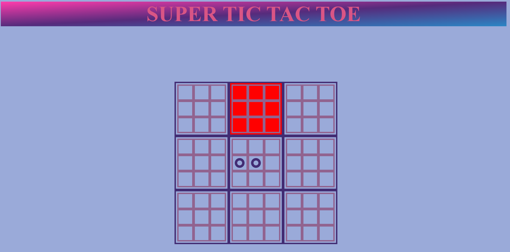
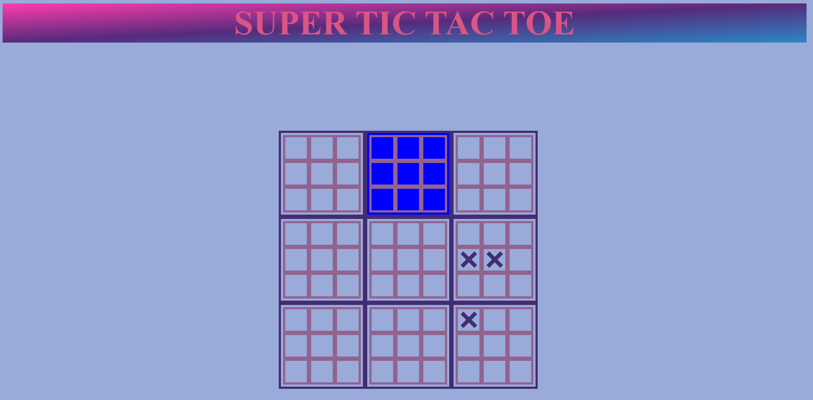
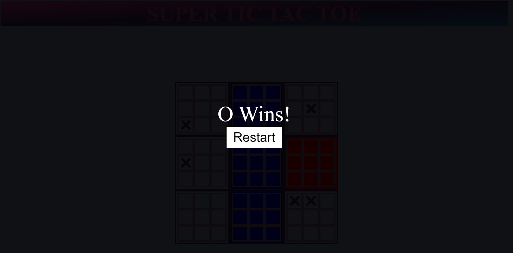

# SUPER TIC TAC TOE

## About

We have all been playing Tic Tac Toe since we were toddlers, now its time to take it up a notch. Welcome to **SUPER TIC TAC TOE** . Venture onto your conquest to rule over not just one tile...BUT **NINE**. 

The objective of this game is to conquer 3 tiles in a row (vertically, horizontally, or diagonally) by winning the smaller grids within. Will your strategy be rush all your moves in a single grid right away and conquer the tile? Or do you want to invest in your future moves and spread your moves out to multiple grids? The way you play the game is entirely up to you. 

### How to Play
- The game will start with a blank board and Player X going first 
- Player X will decide a location to place their character
- It will then be Player Os turn to place their character
- This process will repeat until a tile is won, in which case a tile will turn 🟥RED🟥 to indicate Player X❌ has won the tile or 🟦BLUE🟦 to incidate Player O🔵 has won the tile
- This will once again repeat till either Player X wins 3 tiles in a row, Player O wins 3 tiles in a row, or the game ends in a Draw

**CLICK HERE TO PLAY** [Super Tic Tac Toe](https://zainamirza.github.io/Project-1/)

### Screenshots 

**Starting Board** 

**Player characters Placed**

**Player X wins a tile**

**Player O wins a tile**

**Player Winning Screen with Restart Button**

### Technologies Used
- HTML
- CSS
- JavaScript
- Stack Overflow

### Future Updates
- Add a feature that would let an opposing player take over your tile (forces players to play offense and defense)
- Add fun animations and over the top effects to winning screen
